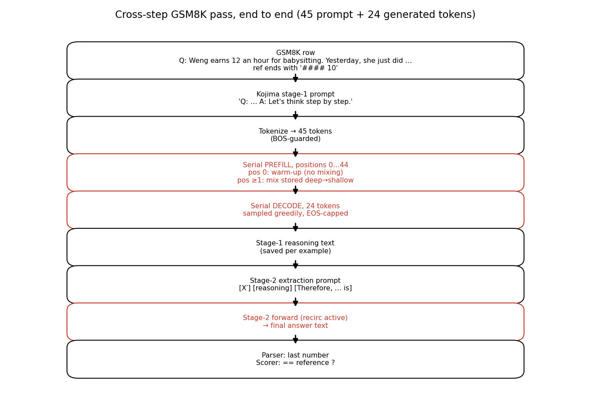
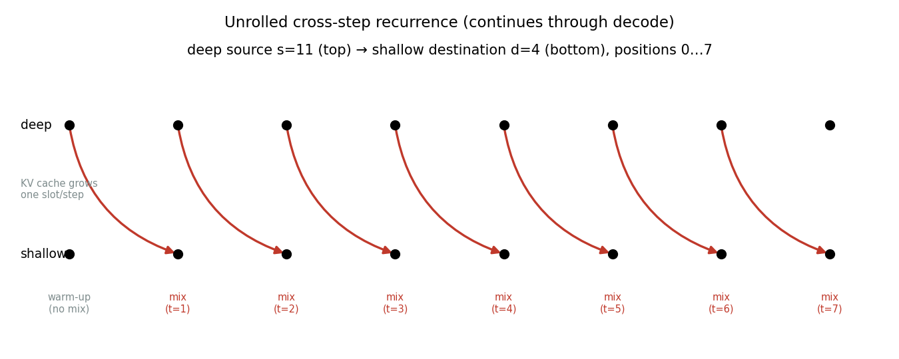
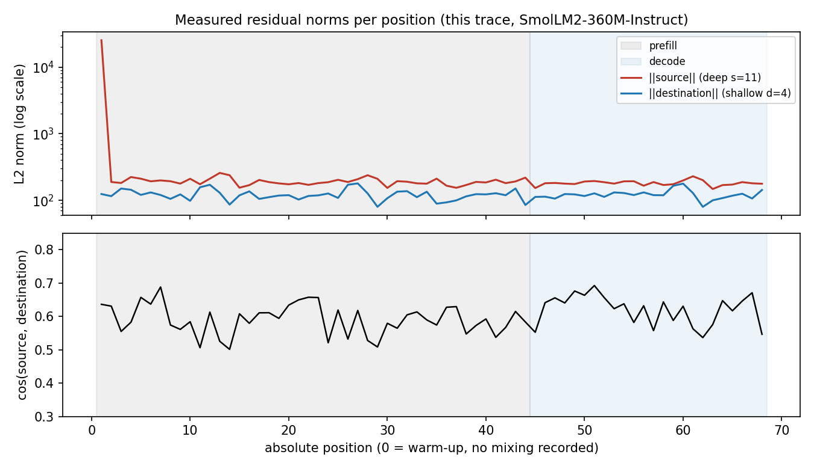

# Appendix: cross-step recirculation, worked end to end

> A concrete trace of what "deep source at step *t* mixes into shallow
> destination at step *t+1*" means operationally — one real GSM8K
> question, real measured numbers, no abstraction without an example.
> Companion to the methods schematic
> (`figures/schematic_recirculation_schedules.png`) and handover §4.3.
>
> **Scope honesty:** the trace below uses SmolLM2-360M-Instruct with a
> 24-token generation cap (mechanics illustration, Figures 1–4). It does
> not score anything and proves nothing about capability — the scored
> evidence lives in the full runs. Model: `HuggingFaceTB/SmolLM2-360M-Instruct`,
> layers 11→4, α=0.15 convex, dest-L2, ramp off. Frozen trace data:
> `reports/data/xstep_trace.json`.

## 0. The question

GSM8K test row (reference answer ends `#### 10`):

```text
Q: Weng earns $12 an hour for babysitting. Yesterday, she just did
50 minutes of babysitting.
```

Rendered through the frozen Kojima template (`gsm8k_kojima_v1` v1.0):

```text
Q: Weng earns $12 an hour for babysitting. Yesterday, she just did
50 minutes of babysitting. A: Let's think step by step.
```

Tokenized to **45 tokens** (BOS-guarded per the paper-v2 rule), e.g.
positions 0–11 decode as `Q : W / eng earns $ / 12 an hour for bab…`.
Everything below is positions, not layers — "steps" in recirculation
always means **input positions advancing left to right**.



## 1. Serial prefill, positions 0–44

Unlike a normal forward pass (whole prompt at once), the adapter feeds
**one token per forward**, maintaining a KV cache exactly like
autoregressive decoding. At each position it runs blocks 0→31 and:

- **position 0 — warm-up, no mixing.** There is no previous deep state
  yet, so block 4 receives its ordinary input. Its deep output at
  block 11 is captured and stored (all 960 dims, detached).
- **positions ≥ 1 — mix.** Before block 5 executes, block 4's output is
  replaced by `d′ = 0.15·f(s) + 0.85·d`, where `s` is the *stored* block-11
  state from the previous position. Blocks 5–31 then run on the mixed
  state, so the KV entries written for this position already contain
  the recirculated influence. The fresh block-11 output overwrites the
  store for the next step.

Batching changes nothing semantically: padded/finished rows are masked
out of mixing, capture, and attention (verified bitwise against the
unbatched path in `test_batch_size_invariance`).

## 2. One mixing event, in measured numbers

At position 1 the debug trace recorded:


Read it as follows: the deep source norm (**25,371**) is **204×** the
destination norm (**124**) — this single measured ratio is *why*
destination-L2 rescaling exists; raw addition would drown the
destination entirely. After rescaling, the mixture lands at norm 118,
on the destination's scale. Cosine 0.636 between two layers 7 blocks
apart is the residual-stream alignment argument made concrete: the
vectors point in similar directions, so the leak enriches rather than
scrambles.

## 3. The recurrence, unrolled



Each arrow is one stored state consumed exactly once, at the next
position. Note what this is *not*: at no point does a deep activation
flow into a shallow layer of the *same* forward pass (that would be
same-step mixing), and no layer is ever re-executed (that would be
looping). The "recurrence" is the stored vector plus the KV cache,
which carries post-mix upper-layer states forward for all later
positions to attend. Decode (positions 45–68 here) runs the identical
loop; sampling reads the final logits each step.

## 4. Measured trace across all 68 mixed positions



Three observations worth carrying into Phase 3:

1. **The 204× ratio is a first-position transient.** Source norms settle
   near ~200 afterwards — still ~2× the destination, so rescaling
   remains load-bearing, but the extreme lives at position 1.
2. **Cosine sits in a 0.5–0.7 band across all 68 positions**, prefill
   and decode alike. Alignment is a stable property of the stream, not
   a lucky step.
3. **No prefill/decode discontinuity.** Norms and cosine continue
   smoothly across the phase boundary (shaded), supporting the design
   choice to recirculate identically in both phases.

## 5. Then stages 2, parse, score (unchanged machinery)

The 24-token stage-1 reasoning text is saved verbatim per example. The
stage-2 extraction prompt (`[stage-1 prompt] [reasoning] Therefore,
the answer (arabic numerals) is`) goes through the same serial loop
with recirculation active; its short output is what the parser scores
(last number-like token) against the reference (`#### 10` →
normalized `10`). All of this is byte-identical code path to the
baseline except the adapter.

## Reproduce

```bash
# measured trace (needs cached SmolLM2 weights; CPU/MPS OK)
conda run -n torch python scripts/trace_walkthrough.py \
  --out reports/data/xstep_trace.json
# figures (needs only reports/data/xstep_trace.json)
conda run -n torch python reports/figures/make_crossstep_trace.py
```

> The trace runner is committed as `scripts/trace_walkthrough.py`
> (parameterized; defaults reproduce this exact trace). The tested
> path underneath is `RecirculationModelAdapter.generate()` +
> `debug_steps`, exercised in
> `tests/integration/test_recirculation.py::test_debug_capture`.
