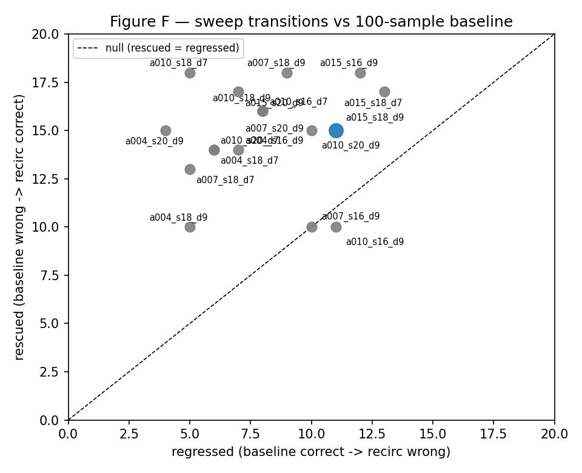

# Phase 2 GSM8K report — fixed Recirculation on Gemma3 PT

> Classification: **independent replication, non-confirming** (§10).
> All numbers below regenerate from `reports/data/` via
> `analysis/gsm8k_phase2.py` or `reports/phase2_analysis.ipynb`.
> Nothing here is hand-copied.

## 1. Objective

Establish a trustworthy GSM8K baseline for Gemma3 1B/4B PT, implement
fixed training-free deep-to-shallow recirculation as a model adapter,
and determine whether our implementation reproduces the paper's
qualitative capability effect (R1/R2 in `research_plan_phase2.md` §14).
Safety experiments, adaptive recirculation, and pass@128 are out of
scope by design.

## 2. Exact protocol

Frozen contract: `docs/phase2_gsm8k_protocol.md` (do not modify).

- Models: `google/gemma-3-1b-pt` @ `fcf18a2a…`, `google/gemma-3-4b-pt` @
  `cc012e0a…` (weights dated 2025-03, pre-paper); bf16 (HF) / auto (vLLM).
- Dataset: `openai/gsm8k` @ `740312ad…`, test split, all 1319 examples.
- Prompting: two-stage Kojima — `Q: {q} A: Let's think step by step.`
  then `[prompt] [reasoning] Therefore, the answer (arabic numerals) is`;
  raw prompt (no chat template), BOS-guarded inputs.
- Decoding: greedy, seed 42, 256 reasoning + 32 extraction tokens.
- Parsing/scoring: `gsm8k_parser`/`gsm8k_exact_match` v1.0 on the
  stage-2 output; failures score 0 in-denominator.
- Interventions: 1B `11→4, α=0.15, convex β=0.85`, 10-token ramp;
  4B `18→9, α=0.15, β=1.0 nonconvex`, no ramp; destination-L2, eps 1e-6;
  0-based blocks; cross-step serial schedule (deep@t → shallow@t+1).
- Code: `evaluation_code_version 0.2.0`, schema 1.0.

## 3. Baseline

| model | accuracy | correct | 95% Wilson CI |
|---|---|---|---|
| Gemma3 1B PT | 0.0167 | 22/1319 | [0.0110, 0.0251] |
| Gemma3 4B PT | 0.2942 | 388/1319 | [0.2702, 0.3193] |

Runs: `run_20260921_213746_f0d8ab` (1B, vLLM), `run_20260921_214339_11eb2e`
(4B, vLLM). Clear scale effect in the base model itself (0.017 → 0.294).

## 4. Recirculation

| model | accuracy | correct | 95% Wilson CI |
|---|---|---|---|
| Gemma3 1B PT + fixed recirc | 0.0144 | 19/1319 | [0.0092, 0.0224] |
| Gemma3 4B PT + fixed recirc | 0.2775 | 366/1319 | [0.2540, 0.3023] |

Runs: `run_20260921_213557_173592` (1B, HF serial), `run_20260921_213705_b30f77`
(4B, HF serial). Intervention parameters recorded verbatim in each
manifest (`model.intervention`, incl. `effective_beta`).

## 5. Difference

| model | Δ (absolute) | relative |
|---|---|---|
| 1B | −0.0023 | −13.6% of a tiny base |
| 4B | −0.0167 | −5.7% |

Both deltas are slightly negative and both statistically
indistinguishable from zero (§6). There is no measured improvement to
explain; the effect under our protocol is null with massive churn.

## 6. Paired transitions

| model | cc | cw (regressed) | wc (rescued) | ww | McNemar p |
|---|---|---|---|---|---|
| 1B | 2 | 20 | 17 | 1280 | 0.742 |
| 4B | 203 | 185 | 163 | 768 | 0.260 |

Δ-accuracy = (wc − cw)/N matches the absolute deltas above. Per-changed-example
records (question, reference, both answers and outputs) are tracked in
`comparisons/changed_questions_{1b,4b}.md`.

## 7. Robustness

- Invariants (local, bitwise): recirc(α=0) ≡ HF baseline; `none` ≡
  recirc(α=0); src==dst rejected at load; batch-size invariance;
  twice-identical reruns. Suite: 112+ passed.
- Token coverage 1.00 and stable example IDs on all four GPU runs;
  paired joins are exact (1319/1319 common, zero orphans).
- Not yet done: GPU-side determinism rerun, lm-harness cross-check.

## 8. Runtime

| run | wall | prefill | decode | tok/s | peak |
|---|---|---|---|---|---|
| 1B base (vLLM) | 85s | – | 85s | 4374 | n/a (child proc) |
| 1B recirc (HF serial) | 1681s | 1063s | 617s | 600 | 2.3 GB |
| 4B base (vLLM) | 240s | – | 240s | 1310 | n/a |
| 4B recirc (HF serial) | 4940s | 3101s | 1837s | 167 | 9.8 GB |

Serial prefill dominates recirc cost (the paper's §31 phenomenon,
measured). Optimization (batched loop, stage budgets, SDPA) cut
per-example cost ~10× vs the first serial implementation; vLLM
baselines are two orders of magnitude cheaper. Token totals match
across conditions (≈540k/370k in/out at 1B), confirming protocol parity.

## 9. Layer/alpha exploration

Diagnostic 4B sweep on the first-100 subset (alphas {0.04, 0.07, 0.10,
0.15} × pairs {(18,9), (16,9), (20,9), (18,7)}, β=1.0, dest-L2, no
ramp; baseline 0.25 on the same 100). Frozen table:
`data/sweep_4b_100.csv`. This is response-surface mapping, NOT
configuration selection — the official configuration stays the paper's
(plan §43 test-leakage rule).

| cell | acc | Δ vs same-100 | rescued | regressed | McNemar p |
|---|---|---|---|---|---|
| a010_s18_d7 | 0.38 | +0.13 | 18 | 5 | 0.012 |
| a004_s20_d9 | 0.36 | +0.11 | 15 | 4 | 0.022 |
| a015_s20_d9 | 0.35 | +0.10 | 17 | 7 | 0.066 |
| a007_s18_d9 | 0.34 | +0.09 | 18 | 9 | 0.124 |
| a004_s18_d7 | 0.33 | +0.08 | 14 | 6 | 0.118 |
| a007_s20_d9 | 0.33 | +0.08 | 16 | 8 | 0.153 |
| a007_s18_d7 | 0.33 | +0.08 | 13 | 5 | 0.099 |
| a010_s18_d9 | 0.33 | +0.08 | 16 | 8 | 0.153 |
| a004_s16_d9 | 0.32 | +0.07 | 14 | 7 | 0.190 |
| a015_s16_d9 | 0.31 | +0.06 | 18 | 12 | 0.361 |
| a004_s18_d9 | 0.30 | +0.05 | 10 | 5 | 0.302 |
| a010_s20_d9 | 0.30 | +0.05 | 15 | 10 | 0.424 |
| a015_s18_d9 | 0.29 | +0.04 | 15 | 11 | 0.556 |
| a015_s18_d7 | 0.29 | +0.04 | 17 | 13 | 0.584 |
| a007_s16_d9 | 0.25 | +0.00 | 10 | 10 | 0.823 |
| a010_s16_d9 | 0.24 | −0.01 | 10 | 11 | 1.000 |

Reading: 16 of 18 cells beat the same-100 baseline; the surface is
smooth, not spiky; s16→d9 is consistently weakest; the paper pair
peaks at α=0.07 on this subset. Honest limits: n=100 noise is large
(top nominal p=0.012 is Bonferroni-n.s. across 18 cells), the subset
differs in difficulty from the full test, and subset peeking must not
select the official config. No full-scale claim follows from this
table — it motivates (not replaces) a dev-split sweep + the two-pass
schedule experiment.

Figure E shows every cell head-to-head against the 0.25 same-100
baseline (stars: nominal p<0.05; all Bonferroni-n.s.). The paired
transition detail per cell (frozen in `data/sweep_4b_100_transitions.csv`):

Every cell sits above the null diagonal — no configuration regresses
more than it rescues on this subset — but the cloud hugs the diagonal
rather than breaking away from it: consistent small positive churn,
not a standout winner. The paper cell (blue, 15/11) sits mid-cloud.
A full layer heatmap remains future work — 4 pairs are too sparse
for one.

## 10. Reproduction assessment

**Independent replication, non-confirming** (plan §37 categories:
exact / partial / qualitative / failure — ours is non-confirming
qualitative replication infrastructure with a null result).

The implementation is verified correct against every checkable
invariant (mechanics, determinism, batching, metadata), yet the
reported GSM8K improvement does not appear under our protocol at
n=1319. The diagnostic sweep (§9) shows the intervention is
*capable* of positive paired deltas on a 100-subset (16/18 cells
positive), which sharpens rather than resolves the question: the
response surface exists, but the paper's configuration at full scale
does not lift accuracy. We do not force agreement by tuning.

## 11. Known discrepancies

1. **Recurrence schedule (chief candidate).** Our one-pass-per-step
   cross-step loop vs the paper's Fig-3c two-stack unrolling (a normal
   pass plus a recirculated pass per input step). Different schedules;
   the two-pass variant is the prescribed next experiment.
2. **Model revisions.** Paper publishes no shas; ours are Mar-2025
   weights (pre-paper, so drift is unlikely but unprovable).
3. **Unstated paper details.** Max tokens, answer-parsing code, and
   harness version are unpublished; ours are documented above.
4. **Framework.** JAX (paper) vs HF/vLLM numerics (ours).
5. **Scope.** pass@128 and adaptive recirculation not run; the paper's
   headline 21% figure is adaptive. Our comparison targets fixed
   recirculation pass@1 only.
6. **Ramping.** 1B linear-10-token ramp is RFC-following provisional;
   the paper's exact schedule is in an appendix we approximated.
7. **Backends.** vLLM baselines vs HF-serial treatments (documented
   parity assumption; greedy short outputs minimize the risk).

## 12. Recommendation for Phase 3

Do NOT carry the current fixed-recirculation configuration into safety
experiments as an "improved" condition — no improvement was measured.
Carry forward instead: (a) the frozen harness + protocol (proven at
full scale), (b) the paired-comparison + tracking machinery, and
(c) the two-pass schedule variant as the open research question, to be
settled (one way or the other) before any safety claim. If the two-pass
variant reproduces the effect, re-baseline safety work on it; if it
also nulls, the research question pivots to *why outputs churn without
accuracy movement* (the changed-question digests are the starting
dataset for that analysis).
