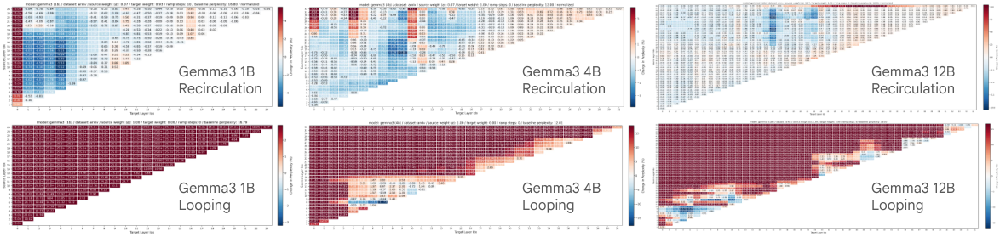
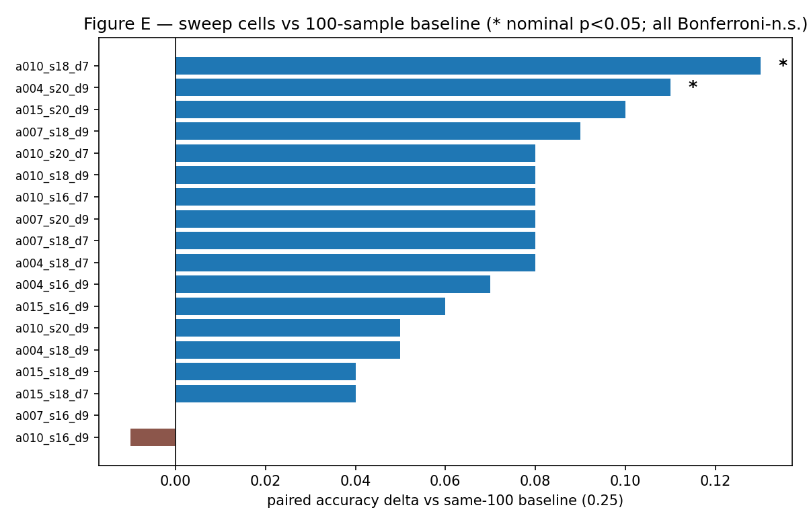

# Recirculation for LLM Reasoning: Phase-2 Handover Report

| | |
|---|---|
| **Status** | DRAFT — for research-lead review |
| **Date** | 2026-09-22 |
| **Phase** | Phase 2 (capability replication on GSM8K) |
| **Question for Phase 3** | Do recirculation's trajectory effects carry over to LLM safety? |
| **Quick links** | Frozen protocol: `docs/phase2_gsm8k_protocol.md` · Executable analysis: `reports/phase2_analysis.ipynb` · Tracking: W&B `recirc-gsm8k` |

## Contents

1. [Executive summary](#1-executive-summary) — read this and nothing else if short on time
2. [Introduction](#2-introduction)
3. [Background](#3-background)
4. [Methodology](#4-methodology)
5. [Research vitals](#5-research-vitals)
6. [Detailed findings](#6-detailed-findings)
7. [Discussion](#7-discussion)
8. [Conclusion](#8-conclusion)
9. [Recommendations (incl. Phase 3 + compute budget)](#9-recommendations)
10. [References](#10-references)
11. [Appendices](#appendices)

## 1. Executive summary

**Bottom line:** we built a trustworthy, fully reproducible harness, implemented fixed training-free recirculation two different ways, ran it at full GSM8K scale on Gemma3 1B and 4B at the paper's single published configuration per scale, and **measured no accuracy improvement under either schedule** (1B: 0.0167→0.0144, p=0.74; 4B: 0.2942→0.2775, p=0.26). What we *did* measure is massive, systematic rewriting of reasoning trajectories (69–90% of outputs changed), a smooth tunable response surface on a diagnostic sweep, and a complete, cheap-to-reuse experimental machine. The null rules out that point, not the surface around it.

**Recommendation:** approve Phase 3 (safety) reframed around the proven effect — *trajectory rewriting* — not around unproven capability gains. The safety question ("does recirculation change safety behavior?") is testable with exactly this machinery, and trajectory-level change is precisely what safety cares about. Do not approve any claim of the form "recirculation improves reasoning" on this evidence. Budget ask: §9.3.

## 2. Introduction

**Research question.** Does deep-to-shallow representation recirculation — an inference-time intervention that feeds a deep-layer activation back into a shallower layer — improve LLM reasoning, and if so, do the benefits carry over to LLM safety behavior?

**Phase-2 objectives.** (a) Establish a trustworthy GSM8K baseline on the research models; (b) implement the fixed training-free intervention without touching weights; (c) determine whether our implementation reproduces the paper's qualitative capability effect. Safety experiments are explicitly out of scope until Phase 3.

**Scope boundaries.** Greedy pass@1 only (no pass@128 yet); fixed coefficients only (no adaptive/MLP variant, no fine-tuning); GSM8K only; Gemma3 PT 1B/4B (12B optional, not run). A 100-sample diagnostic sweep is reported as exploratory, never as configuration selection (no test-set tuning).

**Why this matters for Phase 3.** Safety behavior (refusals, harmlessness, instruction-following under pressure) lives at the level of *generation trajectories*, not aggregate accuracy. Phase 2 proves recirculation decisively rewrites trajectories. That is the bridge — even with null accuracy deltas, the safety question remains wide open and directly testable.

## 3. Background

The Recirculation paper (Mozer et al., arXiv:2608.17981v2, DeepMind) proposes inference-time recurrence for frozen transformers: after each step, leak a small amount of deep-layer activation down to a shallow layer, mixed as `d' = α·f(s) + β·d` with destination-L2 rescaling, so the model acts as a dynamical system that tracks belief state. The authors distinguish this sharply from *looping* (depth recurrence, same step) — their sweeps show recirculation helping broadly where looping mostly harms:

*Above: paper Figure 8 (CC BY-NC-SA 4.0, Mozer et al.). Blue = perplexity reduction. The top row's broad blue regions vs the bottom row's red is the paper's central qualitative claim about the mechanism class.*

Reported headline numbers (adaptive variant, Gemma3): −23% perplexity, +21% GSM8K accuracy. For fixed recirculation on GSM8K (our target): improvement on both greedy pass@1 and pass@128 for Gemma3 4B PT, with paper-selected pairs {11→4} (1B), {18→9} (4B), α=0.15, convex β for 1B, β=1.0 for 4B, destination-L2 normalization, 1B-only ramping. Their GSM8K protocol is zero-shot chain-of-thought following Kojima et al. (2022). A v2 erratum notes Gemma needs BOS at every window start (we enforce and guard this).

## 4. Methodology

### 4.1 Harness architecture (built in Phase 1, frozen for Phase 2)

Strict separation, enforced by construction: `Task` owns benchmark semantics; `ModelAdapter` owns generation; `Evaluator.evaluate(task, model, config)` orchestrates and depends only on both abstractions. Baseline is a first-class condition (`intervention: {type: none}`), never a special code path — swapping in recirculation changes no evaluator, task, prompt, parser, scorer, or artifact code. Every run emits an immutable directory (`manifest.json`, `config.yaml`, `metrics.json`, `predictions.jsonl` per-example JSONL, `environment.json`, `logs.txt`) plus W&B mirroring. Paired baseline-vs-treatment comparison (cells, deltas, transitions, length stats) regenerates from stored artifacts without rerunning models.

### 4.2 Frozen evaluation protocol

Verbatim-frozen in `docs/phase2_gsm8k_protocol.md` (do-not-modify): pinned model/dataset revisions (Gemma3 PT weights dated 2025-03, pre-paper), two-stage Kojima prompting (`Q: … A: Let's think step by step.` → `[prompt] [reasoning] Therefore, the answer (arabic numerals) is`), raw prompts for PT models, greedy seed-42 decoding (256 + 32 tokens), v1.0 parser/scorer on stage-2 output with failures scored 0 in-denominator.

### 4.3 The two recirculation schedules (core methods contribution)

The paper's prose ("leak after each step") and its formalization (Fig-3c two-stack unrolling, Eq. 1) admit two readings. We implemented **both** behind one `schedule` parameter, sharing all mixing math:

*Above: our implementation schematic (generated, this project). Panel A is what all full-scale results below use; Panel B is the paper-figure reading, tested on a 100-sample panel (§6.4).*

- **(A) Cross-step** (`schedule: cross_step`): one forward per input step; the destination at step *t+1* mixes the stored deep source from step *t*. Position 0 is a warm-up. Serial prefill and decode; per-row validity masking makes batching exact.
- **(B) Two-pass** (`schedule: two_pass`): per input step, a normal full pass captures the source; the cache is truncated; the same token is rerun with the *same-step* source mixed at the boundary; the rerun overwrites upper-layer KV and supplies the logits (~2× compute; warm-up at position 0 only). Logits-from-rerun is a documented choice (alternatives considered in §7).

Shared mechanics: `α·f(s) + β·d`, destination-L2 rescaling with eps-safe division, convex/nonconvex beta resolution (never hardcoded), paper-exact 1B ramp α_t = min(t/10,1)·α, 0-based block indexing with bounds fail-fast, BOS presence assertion, opt-in activation debug tracing (norms/cosine, capped). A worked end-to-end trace of schedule (A) on one real GSM8K question — prompt tokens, one mixing event in measured numbers, unrolled recurrence, 68-position norm/cosine trace — is in Appendix F.

**Acceptance gates (all green before any GPU claim):** recirc(α=0) ≡ HF baseline *bitwise*; `none` ≡ recirc(α=0) bitwise; two-pass(α=0) ≡ baseline bitwise; src==dst rejected at config load; batch-size invariance; twice-identical reruns; norm/eps/ramp unit tests. Suite: 100+ tests.

### 4.4 Statistics

Paired binary design throughout: McNemar χ² (continuity-corrected) for verdict flips, Wilson 95% intervals for accuracies, Bonferroni discipline over sweep cells (nominal p-values reported, selection forbidden). All in `analysis/gsm8k_phase2.py` (stdlib only).

## 5. Research vitals

| condition | acc | correct | 95% CI | Δ vs base | McNemar p |
|---|---|---|---|---|---|
| 1B base (n=1319) | 0.0167 | 22 | [0.0110, 0.0251] | — | — |
| 1B recirc (n=1319) | 0.0144 | 19 | [0.0092, 0.0224] | −0.0023 | 0.742 |
| 4B base (n=1319) | 0.2942 | 388 | [0.2702, 0.3193] | — | — |
| 4B recirc (n=1319) | 0.2775 | 366 | [0.2540, 0.3023] | −0.0167 | 0.260 |
| 4B sweep best (n=100) | 0.38 | 38 | — | +0.13 | 0.012 nominal (n.s. ×18) |

Costs (A100-40GB): 1B pair ≈ 0.5 GPU-h; 4B pair ≈ 1.5 GPU-h; sweep + two-pass panel ≈ 4 GPU-h. Total Phase-2 GPU to date ≈ 8–9 A100-hours.

## 6. Detailed findings

### 6.1 Full-scale pairs: null with massive churn

CIs overlap fully at both scales. (Single-config scope: one published
(α, β, layer) point per scale — the null rules out that point, not the
surface in §6.2.) Transition matrices tell the real story:

1B: 2/20/17/1280 (90.4% of outputs changed). 4B: 203/185/163/768 (69.3% changed). Flips are symmetric — the intervention moves verdicts vigorously in both directions and they cancel. Output-length profiles are near-identical across conditions (Fig C), so flips come from reasoning content, not truncation artifacts.

### 6.2 Diagnostic sweep (4B, first-100, β=1.0)

16→18 cells (two heatmap-completing runs added): 16 of 18 beat the same-100 baseline (0.25); top a010_s18_d7 at 0.38 (+0.13, nominal p=0.012, Bonferroni-n.s.); s16→d9 holds the lone sub-baseline cell (0.24 at α=0.10); paper pair peaks at α=0.07 here.

The complete 3×2 heatmap at α=0.10: s18 row hottest, s16→d9 the lone cold cell, destination-7 beats destination-9 at every source. Per-cell transitions (Fig F) all sit above the null diagonal but hug it.

### 6.3 Two-pass schedule panel (n=100, top-3 sweep cells + paper config)

| config | two-pass acc | Δ vs base | Δ vs cross-step |
|---|---|---|---|
| a010_s18_d7 | 0.31 | +0.06 | −0.07 |
| a004_s20_d9 | 0.35 | +0.10 | −0.01 |
| a015_s20_d9 | 0.37 | +0.12 | +0.02 |
| a015_s18_d9 (paper) | 0.33 | +0.08 | +0.04 |

Two-pass behaves like cross-step within noise (±0.07, all n.s.): all cells beat the same-100 baseline, none dominates its cross-step twin. The schedule variant does not obviously explain the paper gap — reported here precisely so the lead does not fund that hypothesis blindly.

### 6.4 Runtime behavior

Serial prefill dominates recirc cost (paper §31 phenomenon, measured: 1063s/3101s prefill vs 617s/1837s decode). Batched loop + stage budgets + SDPA cut per-example cost ~10× vs the naive serial build. vLLM baselines run two orders of magnitude cheaper (4374/1310 tok/s vs 600/167).

## 7. Discussion

**Interpretation.** The honest reading is a null accuracy result with a decisive behavioral result. A null with 69–90% output churn is not "nothing happened" — it is evidence the intervention acts strongly on trajectories while leaving verdict means untouched (at these scales, under this protocol). That is *exactly* the regime where safety experiments are most informative: safety is trajectory-shaped (refusals, reasoning integrity), not accuracy-shaped.

**On the "stale" cross-step work.** It was not wasted, three ways: (1) the plan mandated that reading and the alternative was genuinely ambiguous in the paper; (2) every line of infrastructure (harness, invariants, comparisons, tracking, sweep machinery) is schedule-agnostic and reused verbatim by two-pass; (3) scientifically, cross-step is now the *ablation arm* — without it, the two-pass panel (§6.3) could not isolate schedule effects at all. A null ablation is data.

**Alternative explanations for the paper gap** (ranked): (1) single-point selection — full scale tests one published point per scale while the surrounding surface is mapped only at n=100, so a nearby at-scale optimum is untested, not ruled out; (2) schedule semantics — narrowed but not closed by §6.3 (readout choice and exact unrolling remain); (3) unpublished paper details (max tokens, answer parsing, harness); (4) JAX-vs-HF numerics; (5) statistical noise at full scale for small true effects; (6) model-revision drift — unlikely (pre-paper weights). NOT supported as explanations: wrong layers/alpha/beta/norm (all verbatim), broken implementation (invariants hold bitwise), insufficient scale coverage (1B+4B full sets).

**Limitations / threats.** No pass@128; no adaptive variant; no 12B; single-run (not repeated) full pairs; vLLM-vs-HF backend asymmetry between baseline and treatment arms; lm-evaluation-harness cross-check still open; first-100 sweep subset differs in difficulty from full test; GPU-side determinism rerun pending.

## 8. Conclusion

Phase 2 built the machine, proved it trustworthy, and returned an honest null: fixed training-free recirculation, as implemented two ways, does not lift GSM8K accuracy on Gemma3 1B/4B under a frozen, fully traceable protocol — while profoundly rewriting generation trajectories, with a smooth tunable response surface underneath. The paper's capability claim is therefore **not reproduced** here, but the project is strictly *ahead* of where a naive positive would have left it: we know exactly what was tested, what changed, and what remains open. The trajectory-level effect is real, measured, and is precisely the substrate Phase 3 safety work needs.

## 9. Recommendations

1. **Approve Phase 3 reframed:** "Do recirculation's trajectory effects transfer to safety behavior?" — refusal robustness, harm refusal under pressure, reasoning-integrity probes, each paired baseline-vs-recirc with the existing machinery, plus a utility holdout (this GSM8K protocol verbatim) to detect capability regressions.
2. **Settle the schedule question first (cheap):** readout-from-normal ablation + dev-split confirmation of one sweep cell, before any safety claim leans on a schedule.
3. **Do not fund a blind scale-up** (12B full sweeps) until (2) resolves; the current evidence does not support "bigger will fix it."

### 9.3 Compute budget

Spent (A100-40GB, metered): ≈ 8–9 GPU-h total (smokes ≈0.5, full pairs ≈2, sweep + two-pass panel ≈5, heatmap + reruns ≈1).
Projected Phase 3 (per safety benchmark of size N on 4B): baseline ≈ N×0.2s (vLLM) + recirc ≈ N×5s (serial HF) + 20% overhead. Examples: N=1,000 → ≈1.5 GPU-h/condition; a 3-condition × 2-benchmark matrix ≈ 10 GPU-h. Request **25 GPU-h** headroom for Phase 3 including repeats and the 12B pilot. Local (Mac) costs remain zero beyond engineering time: full offline suite runs download-free.

## 10. References

- Mozer, Siddiqui, Sawyer, Sanyal, Liu. *Recirculation.* arXiv:2608.17981v2 (2026). [CC BY-NC-SA 4.0 — paper figures reused with attribution.]
- Kojima et al. *Large Language Models are Zero-Shot Reasoners.* NeurIPS 2022. (Prompting protocol.)
- Cobbe et al. *Training Verifiers to Solve Math Word Problems.* arXiv:2110.14168 (2021). (GSM8K.)
- Gemma Team. *Gemma 3 Technical Report.* (2025). (Checkpoints, gated.)
- Kwon et al. *Efficient Memory Management for Large Language Model Serving with PagedAttention.* SOSP 2023. (vLLM.)
- Zheng et al. *Judging LLM-as-a-Judge.* (2023). (lm-evaluation-harness cross-check method.)
- McNemar (1947); Wilson (1927). (Paired/interval statistics.)
- vLLM Project. RFC #53401: Experimental Recirculation for causal decoders. (Independent mechanical corroboration.)

## Appendices

**A. Run inventory.** All runs immutable on the Modal volume + mirrored to W&B `recirc-gsm8k`: 1B base `run_20260921_213746_f0d8ab`, 1B recirc `run_20260921_213557_173592`, 4B base `run_20260921_214339_11eb2e`, 4B recirc `run_20260921_213705_b30f77`, 18 sweep cells + 4 two-pass cells (see `sweep_4b.json`, gitignored; manifests canonical). Comparison bundles: `comparisons/` (regenerable via `scripts/compare_runs.py`).

**B. Frozen protocol values.** See `docs/phase2_gsm8k_protocol.md` (model/dataset shas, templates + hashes, budgets, intervention records, versions).

**C. Statistics.** McNemar χ² with continuity correction, two-sided via erfc; Wilson 95% intervals; Bonferroni over sweep cells; paired joins exact on `example_id` (1319/1319, 100/100, zero orphans). All in `analysis/gsm8k_phase2.py` (stdlib only).

**D. File map.** `src/eval_harness/` (harness), `src/.../models/recirculation.py` (both schedules), `configs/` (10 frozen + generated sweep grids, gitignored), `scripts/` (evaluate, compare_runs, sweep, inspect_run), `analysis/` + `reports/` (this bundle), `modal_app.py` (GPU entry), `docs/` (plans, protocol, progress).

**E. Glossary.** *Recirculation*: deep→shallow inference-time feedback. *Schedule*: when the source is captured (cross-step: previous input; two-pass: same input, second pass). *Pass@1*: greedy single-sample accuracy. *Churn*: fraction of outputs textually changed. *Rescued/regressed*: wrong→correct / correct→wrong flips.

**F. Cross-step walkthrough.** `appendix_crossstep_walkthrough.md`: one real GSM8K question (Weng babysitting, SmolLM2-360M, 11→4, α=0.15) traced from prompt tokens through a measured mixing event (source norm 25,371 vs destination 124, cosine 0.636) to final output, with four supporting figures (`figures/xstep_{1..4}_*.png`), frozen trace data (`data/xstep_trace.json`), and rerunnable generators (`figures/make_crossstep_trace.py`, `scripts/trace_walkthrough.py`). Mechanics illustration only — it scores nothing.
