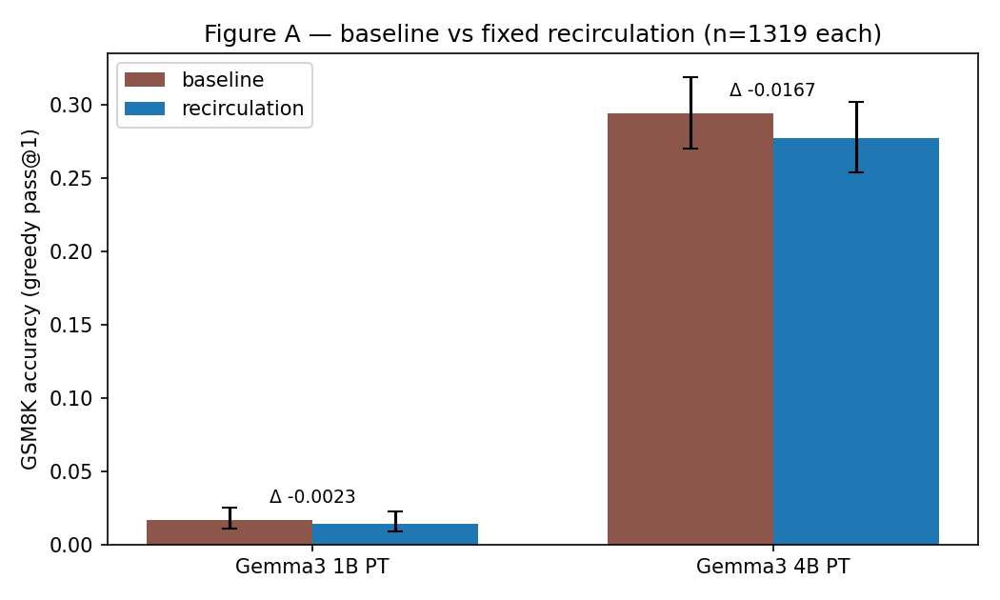
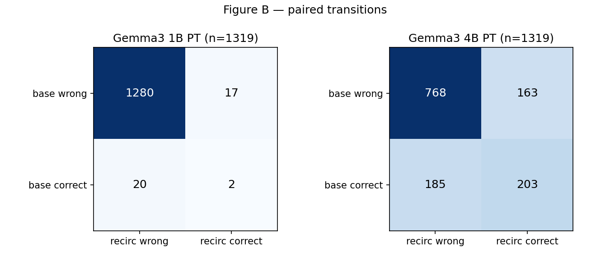

# Recirculation for Reasoning: An Independent Replication

Fixed, training-free deep→shallow feedback on GSM8K — implemented two ways, measured honestly

<!-- notes: Conditional null talk. Lead with the verdict, then earn it through method. -->

---

## Research question

```box
title: Does deep-to-shallow representation recirculation improve LLM reasoning — and do the benefits carry over to LLM safety?
tone: accent
```

- **Phase 2 (this talk):** capability replication on GSM8K — headline is the sweep surface + rewritten trajectories, not the single-config null
- **Phase 3 (next):** safety/security transfer — reframed around what Phase 2 actually proved
- Scope today: fixed coefficients only · greedy pass@1 · GSM8K only · Gemma3 PT 1B/4B

---

## Background: what the paper claims [@mozer2026recirculation]

- Inference-time recurrence for **frozen** transformers: leak deep-layer activation down to a shallow layer each step
- Mixing rule: $d' = \alpha \cdot f(s) + \beta \cdot d$ with destination-L2 rescaling
- **Recirculation ≠ looping** (same-step depth recurrence) — their sweeps show recirculation helping broadly where looping mostly harms
- Reported: −23% perplexity, +21% GSM8K (adaptive, Gemma3); fixed variant improves greedy pass@1 and pass@128 on 4B PT with pairs {11→4} / {18→9}, α=0.15

---

## Harness: trust by construction

- Strict separation: `Task` owns benchmark semantics · `ModelAdapter` owns generation · `Evaluator` orchestrates
- Baseline is a **first-class condition** (`intervention: {type: none}`) — swapping in recirculation changes no evaluator, task, prompt, parser, or scorer code
- Every run emits an immutable directory: manifest, config, metrics, per-example JSONL, environment, logs — plus W&B mirroring
- **Acceptance gates, all green before any GPU claim:** α=0 ≡ baseline bitwise · src==dst rejected · batch-size invariance · identical reruns

---

## Frozen protocol (do-not-modify)

<!-- columns: 2 -->

- Models: Gemma3 PT, weights dated 2025-03 (**pre-paper**); 1B rev `fcf18a2a…`, 4B rev `cc012e0a…`
- Dataset: `openai/gsm8k` test, **n=1319**, raw order, stable ids

|||

- Prompting: two-stage Kojima [@kojima2022] — `Q: … A: Let's think step by step.` → extraction prompt; raw PT prompts, BOS-guarded
- Decoding: greedy, seed 42, 256 + 32 tokens; v1.0 parser/scorer on stage-2 output, failures score 0
- Stats: McNemar flips, Wilson 95% CIs, Bonferroni over sweep cells

---

<!-- columns: 55/45 -->
## Method, step by step (1/3): shared mixing math

Both schedules share one implementation behind a `schedule` parameter:

- $d' = \alpha \cdot f(s) + \beta \cdot d$, destination-L2 rescaling (eps-safe), convex/nonconvex β resolved — never hardcoded
- Tested: **1B** 11→4, α=0.15/β=0.85 convex + ramp · **4B** 18→9, α=0.15/β=1.0, ramp off
- Why rescaling is load-bearing is **measured, not asserted**: first mixed position — source norm **25,371** vs destination norm **124** (204×)

|||

<!-- class: figure-captions -->
<!-- img-align: center -->


---

## Method, step by step (2/3): walkthrough A — cross-step

One forward per input position; destination at step *t+1* mixes the **stored** deep source from step *t* (Weng babysitting question, 45 tokens):

1. **Position 0 — warm-up, no mixing.** No previous deep state; block-11 output captured and stored
2. **Positions ≥ 1 — mix.** Block 4's output ← $0.15 \cdot f(s) + 0.85 \cdot d$; blocks 5–31 run on it, so written KV entries already carry the influence; fresh block-11 output overwrites the store
3. **Decode runs the identical loop** (positions 45–68); cosine stays in a 0.501–0.693 band throughout

<div class="colloquium-footnote">Full trace: reports/appendix_crossstep_walkthrough.md · frozen data/xstep_trace.json · all full-scale results use this schedule.</div>

---

## Method, step by step (3/3): walkthrough B — two-pass (the paper-figure reading)

Per input position, **two** forwards:

1. A normal full pass **captures** the source; the cache is **truncated**
2. The same token is **rerun** with the same-step source mixed at the boundary; the rerun overwrites upper-layer KV and supplies the logits
3. Cost ~2× compute; warm-up at position 0 only; at α=0 bitwise identical to baseline

```box
title: Documented choice, not a theorem
tone: surface
content: |
  Logits come from the rerun. A readout-from-normal ablation is cheap future work — held open, not assumed.
```

---

## The two readings, compared

| | cross-step (A) | two-pass (B) |
|---|---|---|
| source capture | previous position | same position, first pass |
| forwards / position | 1 | 2 (~2× compute) |
| logits from | the single mixed pass | the mixed rerun |
| full-scale evidence | n=1319 × 2 scales | — |
| panel evidence | comparison baseline | n=100, 4 cells |

The paper's prose and its Fig-3c formalization admit both readings — so we built both. Without the cross-step arm, the two-pass panel could not isolate schedule effects at all.

---

<!-- class: figure-captions -->
<!-- img-fill: true -->
## Schematic: the two schedules as implemented


---

## Ours vs looping transformers

- **Looping** = re-execute a block of layers on the *same* input (depth recurrence inside one forward pass)
- **Ours: no layer is ever re-executed** — every block runs exactly once per position
- Influence travels *across* positions instead: one stored vector + a KV cache written post-mix
- Both schedules are pure recirculation — the paper's Figure-8 contrast applies to what we test; our null says nothing about looping

---

## Ours vs the paper's recirculation

<div class="text-sm">

1. **Schedule.** Prose reading → cross-step; figure reading → two-pass. Both built, alike within noise (§4.3) — but exact unrolling and the readout choice stay open.
2. **Harness.** Paper unpublished (model SHAs, budgets, parsing) → ours frozen and printed, not guessed. Serial prefill + per-row masking; BOS guard per the v2 erratum.
3. **Numerics.** JAX-vs-HF unaddressed by design; 1B ramp as published but provisional.

</div>

---

## Evidence map: three blocks, two methods

<!-- notes: Talk track: we started with the paper's suggested params and got a null — so we swept around them and found a live surface — then we checked the paper's own reading and it tells the same story. -->

- **A · Full-scale pairs** — <span style="color:#1f77b4">cross-step (ours)</span>, n=1319 × 2 scales, paper's single point per scale → **null**, 69–90% churn
- **B · Diagnostic sweep** — <span style="color:#1f77b4">cross-step (ours)</span>, n=100, 18 cells → **16/18 beat baseline**, best +0.13
- **C · Schedule panel** — <span style="color:#2e7d32">two-pass (paper reading)</span> vs cross-step twins, n=100, 4 cells → **beats base, ±0.07 vs twins**

---

<!-- columns: 40/60 -->
## A · Single-config check (cross-step, n=1319): null verdict, live trajectories

- Tested exactly **one (α, β, layer) point per scale** — the paper's published settings, not a tuned selection
- 1B Δ −0.0023 (p=0.742) · 4B Δ −0.0167 (p=0.260); CIs overlap fully — verdict: null **at that point**
- …but 90.4% / 69.3% of outputs changed textually — next slide

|||

<!-- class: figure-captions -->
<!-- img-align: center -->



---

<!-- class: figure-captions -->
## A · What changed (cross-step, n=1319): trajectories rewritten

- Flips are **symmetric** — the intervention moves verdicts vigorously in both directions and they cancel
- Output-length profiles near-identical: flips come from reasoning content, not truncation artifacts
- A null mean with 69–90% churn is not "nothing happened" — it is trajectory-level action, the substrate safety cares about



---

## Caveats — what the single-config null does and doesn't say

<div class="text-lg">

1. **One published config per scale — not a tuned selection.** The n=1319 runs test the paper's point settings; the surface around them is the next two slides.
2. **Conditional on our frozen two-stage protocol.** The paper's exact prompting, budgets, and parsing are unpublished — this null covers our realization, not every prompting. (1B additionally sits near floor: 22/1319 baseline correct.)
3. **Single runs; backend asymmetry** (vLLM baselines vs serial-HF treatments). No pass@128, no adaptive variant, no 12B.

</div>

---

<!-- layout: section-break -->

## The comprehensive study: an 18-cell sweep

Not one point — the surface around it

---

<!-- class: figure-captions -->
## B · Sweep (cross-step, 4B, n=100): 16 of 18 cells beat baseline

- Same-100 baseline **0.25**; best `a010_s18_d7` at **0.38** (+0.13, nominal p=0.012, Bonferroni-n.s.)
- Paper pair peaks at α=0.07 here; destination-7 beats destination-9 at every source

<div class="colloquium-footnote">First-100 subset (baseline 0.25 vs 0.2942 full-test): exploratory surface, never configuration selection.</div>


---

<!-- class: figure-captions -->
<!-- img-fill: true -->
## B · Layer landscape (cross-step, α=0.10): s18 hot, s16→d9 cold


---

## C · Two-pass panel (paper reading, n=100): same story

| config | two-pass acc | Δ vs base | Δ vs cross-step |
|---|---|---|---|
| a010_s18_d7 | 0.31 | +0.06 | −0.07 |
| a004_s20_d9 | 0.35 | +0.10 | −0.01 |
| a015_s20_d9 | 0.37 | +0.12 | +0.02 |
| a015_s18_d9 (paper) | 0.33 | +0.08 | +0.04 |

All cells beat the same-100 baseline; none dominates its cross-step twin. The schedule variant does not obviously explain the paper gap — readout choice and exact unrolling remain open.

---

<!-- layout: section-break -->

## The bridge to Phase 3

A null with 69–90% output churn is not "nothing happened"

---

## Implication: safety lives in trajectories

- Safety behavior — refusals, harmlessness under pressure, reasoning integrity — lives at the level of **generation trajectories**, not aggregate accuracy
- Phase 2 proves recirculation **decisively rewrites trajectories**. That is precisely the substrate safety work needs
- Schedule-agnostic premise: cross-step 69–90% churn at scale · two-pass 18–30 verdict flips per 100 — Phase 3 can probe both without betting on one
- Phase 3, reframed: *"Do recirculation's trajectory effects transfer to safety behavior?"* — refusal robustness, harm refusal under pressure, reasoning-integrity probes, each paired baseline-vs-recirc, plus a GSM8K utility holdout against regressions
- Settle the schedule question first; no blind 12B scale-up. Ask: **25 GPU-h** (Phase 2 cost ≈8–9 total)

---

## Why fund the cross-step track?

<!-- notes: Anticipate "why not just run Mozer's variant on safety?" — evidence, cost, ablation, deployability, in that order. Concede the capability point; Phase 3 isn't about capability. -->

- **Evidence:** only cross-step has a measured trajectory effect *at scale* (69–90% churn); two-stack has paper perplexity, no independent trajectory evidence
- **Cost:** one forward per position vs two — halves the recirc arm at safety-benchmark volumes; runs in plain HF (two-stack serving needs engine support, RFC still open)
- **Ablation:** both arms tell us whether safety transfer is schedule-specific or general — Mozer-only throws away the control
- **Deployability:** an inference-time safety intervention must be cheap enough to ship; single-pass is closer to that bar

<div class="colloquium-footnote">Conceded: for maximum capability, two-stack has the paper's headlines — but Phase 3 is about trajectory effects, where cross-step is proven and two-stack is assumed.</div>

---

## Conclusion

- Single-config full-scale check (paper's settings, both scales): null verdict — it rules out a point, not the surface
- The **18-cell sweep** maps that surface: 16 of 18 beat baseline, smooth tunable response, s18 hot / s16→d9 cold
- Everything regenerates from committed artifacts: frozen protocol, paired CSVs, executable notebook, walkthrough trace + generators; run dirs on Modal + W&B `recirc-gsm8k`
