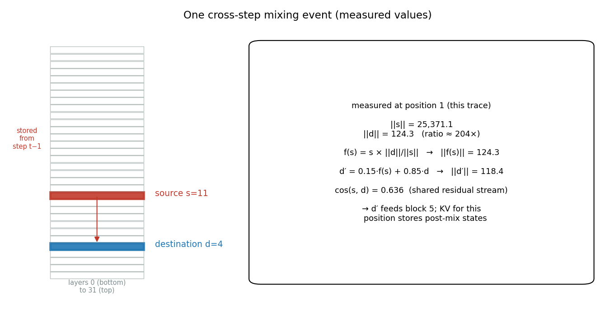
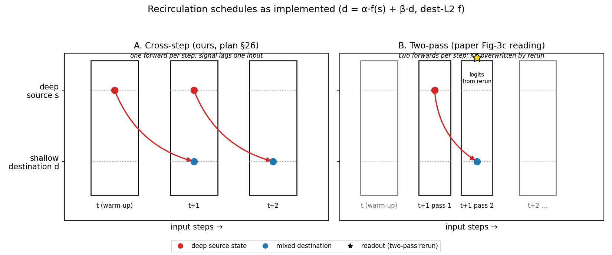
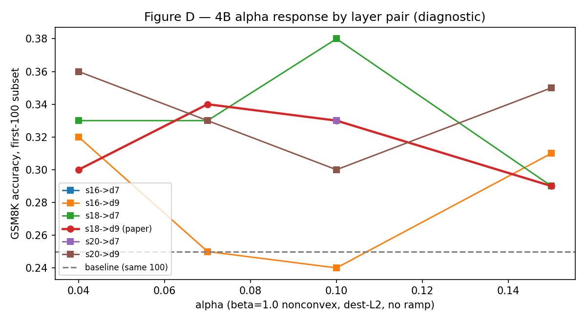
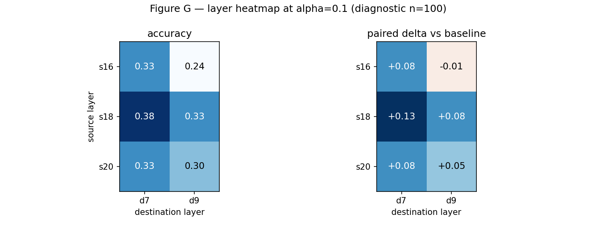

# Recirculation on GSM8K: Replication Within Noise, a Suggestive Control, and One Cell Confirmed at Scale

Paper-exact Mozer replication, a withdrawn-class cross-step control, and a sweep cell tested at full n=1319 — all p-values exact

<!-- notes: Verdict-first talk. Three numbers: 531 vs 540/554 (replication, n.s.), 559 vs 531 (+28, p=0.054, n.s.), 461 vs 388 (confirmed, unpaired p~0.002). No novelty claimed for cross-step. -->

---

## Research question

```box
title: Does deep-to-shallow representation recirculation change LLM reasoning — and do the effects carry over to LLM safety?
tone: accent
```

- **Phase 2 (this talk):** capability replication on GSM8K — headline is now the replication block + one confirmed cell, with the prior null as context
- **Phase 3 (next):** safety/security transfer — reframed around proven trajectory effects, carrying both schedules
- Scope today: fixed coefficients only · greedy pass@1 · GSM8K/Platinum · Gemma3 1B IT + 4B PT

---

## Background: what the paper claims [@mozer2026recirculation]

- Inference-time recurrence for **frozen** transformers: first-iteration readout, then same-token deep→shallow mixing, upper-stack replay replacing that token's upper KV — **no second readout**
- Mixing rule: $d' = \alpha \cdot f(s) + \beta \cdot d$ with destination-L2 rescaling
- **Recirculation ≠ looping** (same-step depth recurrence) — their sweeps show recirculation helping broadly where looping mostly harms
- Reported: −23% perplexity, +21% GSM8K (adaptive); fixed variant gains on 4B PT; reference Platinum/1B IT evidence: dense **540/1209**, recirc **554/1209** at 25→20, α=0.04
- The reference repo **withdrew** its early delayed cross-token implementation as non-recirculation evidence — the class our cross-step control belongs to

---

## Harness: trust by construction

- Strict separation: `Task` owns benchmark semantics · `ModelAdapter` owns generation · `Evaluator` orchestrates
- Baseline is a **first-class condition** (`intervention: {type: none}`) — swapping schedules changes no evaluator, task, prompt, parser, or scorer code
- Every run emits an immutable directory: manifest, config, metrics, per-example JSONL, environment, logs — plus W&B mirroring
- **Three schedules** behind one flag: `mozer` (paper-exact) · `cross_step` (withdrawn class) · `two_pass` (panel)
- **Acceptance gates:** α=0 ≡ baseline bitwise · batch-size invariance · identical reruns · 124 unit tests green

---

## Parity protocol (what "same as the repo" means)

<!-- columns: 2 -->

- Model: `gemma-3-1b-it`, Hub rev `dcc83ea841ab` (theirs unrecorded — stated, not hidden)
- Prompt: `cot_llama` 8-shot, **multiturn** (17 messages) + chat template — single-turn scores ~35%, multiturn reaches the regime
- Decoding: greedy, seed 42, 256 tokens, FP16, repo stop strings, **model EOS [1, 106]** (tokenizer scalar 1 alone never fires)

|||

- Extraction: `####` → answer-line → boxed → last-line → last-number, Decimal compare (parser v1.1)
- Positions: per-row `position_ids` under left padding (shared scalar misplaces RoPE)
- Sliding-window replay: arm → pass 1 → `crop(-1)` → pass 2 → `crop(0)`
- Stats: exact McNemar (binomial), Wilson CIs, Bonferroni over sweep cells

---

<!-- columns: 55/45 -->
## Method, step by step (1/3): shared mixing math

All schedules share one implementation behind a `schedule` parameter:

- $d' = \alpha \cdot f(s) + \beta \cdot d$, destination-L2 rescaling (eps-safe), convex/nonconvex β resolved — never hardcoded
- Replication: **1B IT** 25→20, α=0.04/β=0.96 convex · **4B PT** 18→7, α=0.10/β=1.0 nonconvex
- Why rescaling is load-bearing is **measured, not asserted**: first mixed position — source norm **25,371** vs destination norm **124** (204×)

|||

<!-- class: figure-captions -->
<!-- img-align: center -->



---

## Method, step by step (2/3): mozer (paper-exact) vs cross-step (control)

- **Mozer:** pass 1 full stack captures source + destination and supplies the logits; pass 2 mixes the *same-step* source, replays blocks d+1..N, overwrites upper KV — **no readout from the replay** (~2× forwards/token; measured 1296 s full run)
- **Cross-step:** one forward per step; shallow boundary at *t* mixes the *stored previous-token* source; KV stores post-mix states; readout from the mixed run (~1×; measured 669 s) — withdrawn class, non-novel, reported as a control
- Position 0 warm-up in all schedules; padded/finished rows masked (bitwise batch-invariant)

<div class="colloquium-footnote">Full trace: reports/appendix_crossstep_walkthrough.md · frozen data/xstep_trace.json. Cost measured same-harness, batch 128: cross-step ≈ half the mozer arm.</div>

---

## Method, step by step (3/3): two-pass (panel reading)

Per input position, **two** forwards with **rerun readout**:

1. A normal full pass **captures** the source; the cache is **truncated**
2. The same token is **rerun** with the same-step source mixed at the boundary; the rerun overwrites upper-layer KV **and** supplies the logits
3. Cost ~2× compute; at α=0 bitwise identical to baseline — n=100 panel only in this study

```box
title: Three schedules, three readouts
tone: surface
content: |
  mozer: first-pass readout (paper) · two-pass: rerun readout (panel) · cross-step: mixed-run readout, previous-token source (control).
```

---

## The three schedules, compared

| | mozer (paper) | two-pass (panel) | cross-step (control) |
|---|---|---|---|
| source capture | same position, pass 1 | same position, pass 1 | previous position |
| forwards / position | 2 (~2×) | 2 (~2×) | 1 (~1×) |
| logits from | first (normal) pass | the mixed rerun | the single mixed pass |
| full-scale evidence | Platinum n=1209: **531** | — | Platinum n=1209: **559** · 4B n=1319: **461** |
| status | replicates within noise | panel, ±0.07 of twins | suggestive, non-novel |

Without the cross-step arm, neither the fair mozer comparison nor the 4B confirmation would exist.

---

<!-- class: figure-captions -->
<!-- img-fill: true -->
## Schematic: the schedules as implemented



<div class="colloquium-footnote">Mozer differs from panel B only in readout (first-pass logits kept, replay KV-only). Diagram mechanics unchanged.</div>

---

## Ours vs looping transformers

- **Looping** = re-execute a block of layers on the *same* input (depth recurrence inside one forward pass)
- **Mozer/cross-step: no layer is ever re-executed for readout** — influence travels *across* positions through stored state + post-mix KV
- The paper's Figure-8 contrast applies to what we test; our numbers say nothing about looping

---

## Ours vs the paper's recirculation — deltas, all documented

<div class="text-sm">

1. **Schedule.** Mozer arm is paper-exact (same-token replay, first-pass readout). Cross-step is the withdrawn class — labeled control, never "recirculation," never novel.
2. **Harness.** Reference revision unrecorded; attention eager/FA2 vs our SDPA serial loop; continuous batching vs chunked batches. Math matched, engines differ.
3. **Numerics.** FP16 matched; JAX-vs-HF unaddressed by design.

</div>

---

## Evidence map: four blocks, three schedules

<!-- notes: Talk track: replicate the paper's number first (531 vs 540/554) — then the same-harness control (+28, p=0.054) — then the sweep cell graduates at full scale — prior null as context. -->

- **A · Replication** — <span style="color:#1f77b4">mozer</span>, Platinum n=1209, repo protocol → **531, within noise** (p=0.58/0.12)
- **B · Cross-step IT** — <span style="color:#b26a00">cross-step</span>, same harness n=1209 → **559, +28 paired, p=0.054** (n.s.)
- **C · Sweep confirmation** — <span style="color:#b26a00">cross-step a010_s18_d7</span>, 4B n=1319 → **461 vs 388, +73, unpaired p≈0.002**
- **D · Prior context** — <span style="color:#666666">P2-PT pairs + sweep + two-pass panel</span> → nulls, surface, schedule-indifference

---

## A · Replication (Platinum 1B IT, n=1209): within noise

| Arm | Correct | Accuracy | 95% CI | Δ vs repo dense | exact p |
|---|---|---|---|---|---|
| Repo dense (taken) | 540 | 0.4467 | [0.419, 0.475] | — | — |
| Repo recirc (taken) | 554 | 0.4582 | [0.430, 0.486] | +0.0116 | 0.20 |
| **Ours mozer** | **531** | **0.4392** | [0.411, 0.467] | −0.0074 | 0.58 |
| **Ours cross-step** | **559** | **0.4624** | [0.434, 0.491] | +0.0157 | 0.25 |

- Ours-cross vs ours-mozer paired: 112 vs 84 discordants, **+28 (+0.0232), p=0.054** — borderline, not significant
- Per-row agreement ours-mozer / repo-dense: **82.4%** · parse rate 100% both arms · CIs overlap fully
- Nobody's GSM8K delta here clears significance — including the reference's own +14

---

## B · What the control means (and doesn't)

- Cross-step measures **slightly above** mozer on the shared protocol (+28, p=0.054) at **half the compute** (669 s vs 1296 s full runs)
- It is **not the paper's method** (previous-token source, mixed-run readout) and **not novel** (withdrawn class, prior feedback literature)
- Promoted from "ablation" to "legitimate cost-effective control" — still not to "method" or "discovery"
- Trajectory churn (69–90% PT outputs rewritten, symmetric flips) is the mechanism-level evidence Phase 3 inherits

---

## Caveats — what these numbers do and don't say

<div class="text-lg">

1. **No in-harness dense arm** (repo dense taken by plan); residual harness bias is shared by our arms, not by the repo numbers.
2. **4B confirmation is unpaired** — archived baseline lacks matching per-row verdicts, so no McNemar; the unpaired test is conservative. Dev-split paired confirmation is commissioned next.
3. **Single path/alpha per study line**; greedy only; no 12B/adaptive/pass@128; single runs each.
4. **Prior-protocol nulls stand as context** (1B p=0.74; 4B 18→9 p=0.26) under a non-parity harness — a different 4B cell than the confirmed one.

</div>

---

<!-- layout: section-break -->

## From caution to confirmation: the sweep cell graduates

The Bonferroni caution was correct — and then the cell was tested

---

## C · Sweep → full scale: a010_s18_d7 held up

- n=100 diagnostic: `a010_s18_d7` at **0.38** (+0.13 over 25/100 baseline, nominal p=0.012, **Bonferroni-n.s.** ×18) — reported as surface, never selection
- Full n=1319 at the same cell (4B PT, kojima, β=1.0): **461 (0.3495)** vs 388 (0.2942) baseline — **+73 rows (+0.0553), unpaired p≈0.002**
- The cautionary tale graduates by testing: destination-7 beats destination-9 at every source; s18 row hottest
- Different cell than the v0.1 headline (18→9, α=0.15: 366, n.s.) — the surface varies, exactly as mapped

<!-- class: figure-captions -->
<!-- columns: 40/60 -->
## B · Sweep (cross-step, 4B, n=100): 16 of 18 cells beat baseline

- Same-100 baseline **0.25**; best `a010_s18_d7` at **0.38** (+0.13, nominal p=0.012, Bonferroni-n.s.)
- Paper pair peaks at α=0.07 here; destination-7 beats destination-9 at every source

<div class="colloquium-footnote">First-100 subset (baseline 0.25 vs 0.2942 full-test): exploratory surface — which then nominated the confirmed cell.</div>

|||

<!-- img-align: center -->



---

<!-- class: figure-captions -->
<!-- img-fill: true -->
## B · Layer landscape (cross-step, α=0.10): s18 hot, s16→d9 cold



---

## Gemma quirks log: six hazards, all fixed

1. **Multiturn default** — `fewshot_as_multiturn` resolves True: 17 messages, not one packed prompt (~35% → regime)
2. **Model EOS [1, 106]** — tokenizer scalar 1 alone never fires; 99% rammed the cap before the fix
3. **Left-padding positions** — per-row `position_ids` from the cumulative mask, or RoPE drifts
4. **Sliding-window replay** — arm → pass 1 → `crop(-1)` → pass 2 → `crop(0)`; skipping the restrict overflows the window
5. **Stops + extraction priority** — repo stop list, answer-line-first parsing (parser v1.1)
6. **Silent drift** — unrecorded revisions, BF16-vs-FP16 flips: pin everything in manifests

---

## Cost model: measured, not modeled

- Full runs, same harness batch 128: **cross-step 669 s · mozer 1296 s** — one vs two forwards per token, ~2× measured
- Batch-128 ceiling validated by 32→64→128 probe (peaks ≈3.6→6.7→16.5 GB single-turn, ≈20 GB multiturn): ~2× headroom on 40 GB
- Session total ≈ 2 GPU-h (JarvisLabs A100); project cumulative ≈ 10–11 GPU-h
- Our slowness vs vLLM baselines is **engine-vs-eager**, not method-vs-method

---

<!-- layout: section-break -->

## The bridge to Phase 3

Replication within noise, one suggestive control, one confirmed cell

---

## Implication: safety lives in trajectories

- Safety behavior — refusals, harmlessness under pressure, reasoning integrity — lives at the level of **generation trajectories**, not aggregate accuracy
- Both schedules rewrite trajectories at scale; cross-step now has full-scale evidence at half the compute — carry **both** into Phase 3
- Phase 3, reframed: *"Do trajectory effects transfer to safety behavior?"* — refusal robustness, harm refusal under pressure, reasoning-integrity probes, each paired baseline-vs-recirc, plus a GSM8K utility holdout against regressions
- First commission: dev-split 4B-cell confirmation with paired artifacts + in-harness dense arm. No blind 12B scale-up. Ask: **25 GPU-h**

---

## Why fund the cross-step track?

<!-- notes: It is no longer "the stale reading" — it has full-scale evidence and half the cost. Still concede capability and novelty. -->

- **Evidence (new):** full-scale 559 (IT, suggestive) + 461 (4B, confirmed cell) — no longer just churn; still honestly p-valued
- **Cost:** one forward per position — halves the recirc arm at safety-benchmark volumes; runs in plain HF
- **Ablation:** both arms tell us whether safety transfer is schedule-specific or general
- **Deployability:** an inference-time safety intervention must be cheap enough to ship; single-pass is closer to that bar

<div class="colloquium-footnote">Conceded, in writing: cross-step is not the paper's method and not novel. Phase 3 bets on trajectory effects, where both schedules are now evidenced.</div>

---

## Conclusion

- **Replication:** paper-exact mozer lands within noise of the reference band (531 vs 540/554; p=0.58/0.12) — implementation confirmed
- **Control:** cross-step measures +28 paired rows above mozer (p=0.054, n.s.) at half the compute — suggestive, non-novel, honestly labeled
- **Confirmation:** sweep-nominated `a010_s18_d7` holds at full scale (461 vs 388, unpaired p≈0.002)
- Everything regenerates from committed artifacts: parity configs, run dirs (`results_jl/`), reference JSONs, sweep tables, W&B `recirc-gsm8k`
